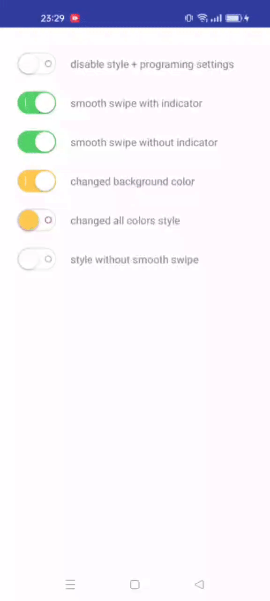

# SwitchButton
SwitchButton.An *beautiful+lightweight+custom-style-easy* switch widget for Android,minSdkVersion >= 11<br>
issues welcome~<br>
<br>

Features
-------
-depend without third-part library<br>
-without raw files(pictures/drawables etc...), only one java and style.xml file<br>
-drag switch supported<br>


UseAge
-------
gradle:
```grovvy
repositories {
    mavenCentral()
    jcenter()
}

...

dependencies {
    compile 'com.github.zcweng:switch-button:0.0.3@aar'
}
```

layout.xml:
```xml
<LinearLayout xmlns:android="http://schemas.android.com/apk/res/android"
              android:layout_width="match_parent"
              android:layout_height="match_parent"
              xmlns:app="http://schemas.android.com/apk/res-auto"
              android:orientation="vertical">

    <com.suke.widget.SwitchButton
        android:id="@+id/switch_button"
        android:layout_width="wrap_content"
        android:layout_height="wrap_content"/>

</LinearLayout>
```

Activity.java:
```java
com.suke.widget.SwitchButton switchButton = (com.suke.widget.SwitchButton)
    findViewById(R.id.switch_button);

switchButton.setChecked(true);
switchButton.isChecked();
switchButton.toggle();     //switch state
switchButton.toggle(false);//switch without animation
switchButton.setShadowEffect(true);//disable shadow effect
switchButton.setEnabled(false);//disable button
switchButton.setEnableEffect(false);//disable the switch animation
switchButton.setOnCheckedChangeListener(new SwitchButton.OnCheckedChangeListener() {
    @Override
    public void onCheckedChanged(SwitchButton view, boolean isChecked) {
        //TODO do your job
    }
});


```

More Style:
```xml
<attr name="sb_shadow_radius" format="reference|dimension"/>       阴影半径
<attr name="sb_shadow_offset" format="reference|dimension"/>       阴影偏移
<attr name="sb_shadow_color" format="reference|color"/>            阴影颜色
<attr name="sb_uncheck_color" format="reference|color"/>           关闭颜色
<attr name="sb_checked_color" format="reference|color"/>           开启颜色
<attr name="sb_border_width" format="reference|dimension"/>        边框宽度
<attr name="sb_checkline_color" format="reference|color"/>         开启指示器颜色
<attr name="sb_checkline_width" format="reference|dimension"/>     开启指示器线宽
<attr name="sb_uncheckcircle_color" format="reference|color"/>     关闭指示器颜色
<attr name="sb_uncheckcircle_width" format="reference|dimension"/> 关闭指示器线宽
<attr name="sb_uncheckcircle_radius" format="reference|dimension"/>关闭指示器半径
<attr name="sb_checked" format="reference|boolean"/>               是否选中
<attr name="sb_shadow_effect" format="reference|boolean"/>         是否启用阴影
<attr name="sb_effect_duration" format="reference|integer"/>       动画时间，默认300ms
<attr name="sb_button_color" format="reference|color"/>            按钮颜色
<attr name="sb_show_indicator" format="reference|boolean"/>        是否显示指示器，默认true：显示
<attr name="sb_background" format="reference|color"/>              背景色，默认白色
<attr name="sb_enable_effect" format="reference|boolean"/>         是否启用特效，默认true
```


ScreenShot
-------
<a href="https://github.com/zcweng/SwitchButton/blob/master/sample/sample-debug.apk">Sample Apk:</a><br>
<br>


License
-------
MIT, See the <a href="https://github.com/zcweng/SwitchButton/blob/master/LICENSE">[LICENSE]</a> file for details.
